# Alexa Setup

Register an account on the [Alexa Developer Console](https://developer.amazon.com/alexa/console)

# Create A Skill

Select the 'Create Skill' button on the far right.

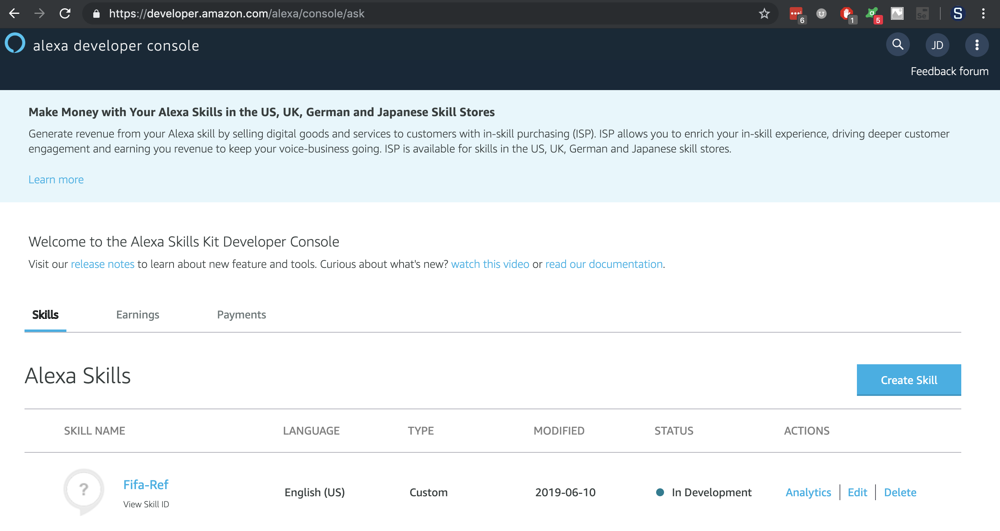

# Name the Skill

You can set a generic skill name, like 'Fifa Hack'. Accept the other defaults and click the 'Create Skill' button on the top right.

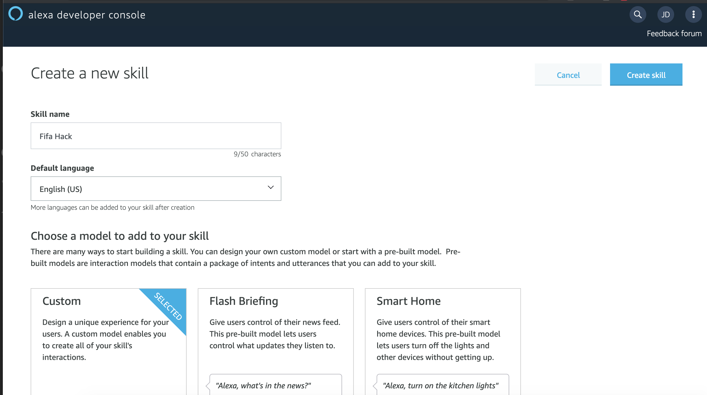

# Skill Template

Accept the default template of 'Start from scratch' and click 'Choose'.

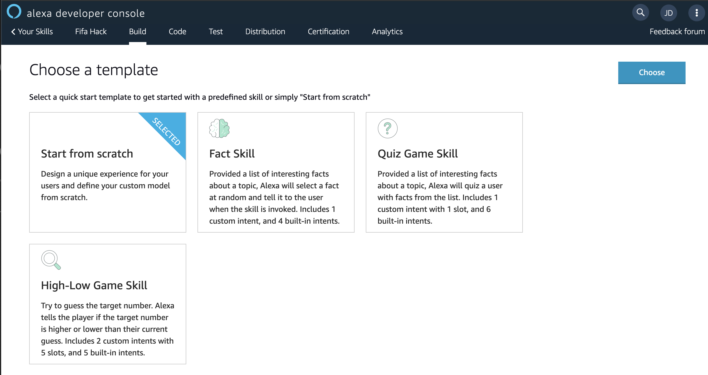

# Invocation Model

The JSON is provided to install the exact invocation model for the skill. Select the JSON Editor in the bottom of the skill menu on the left.

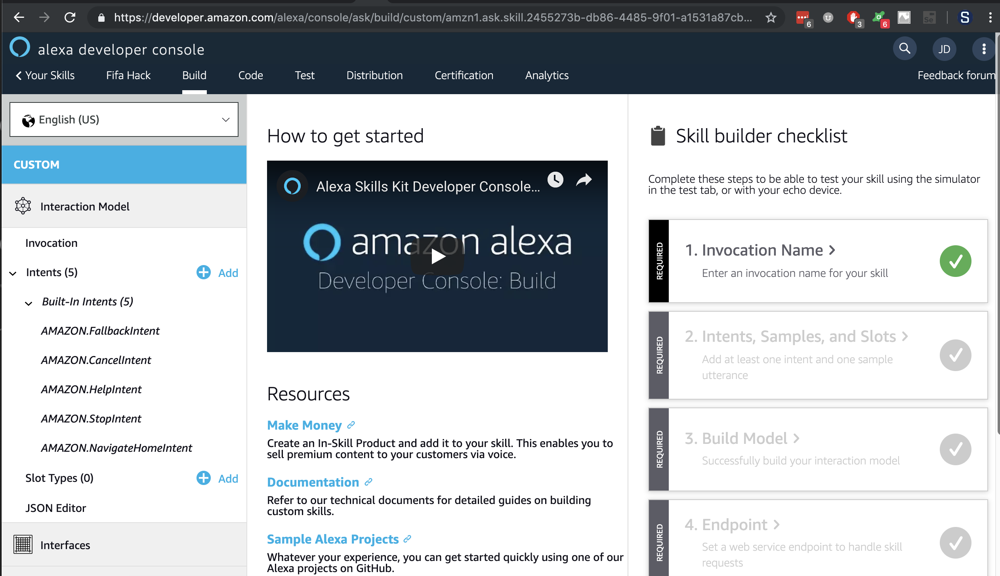

Paste the contents of [interaction-model.json](../interaction-model.json) into the text box and select 'Save Model'

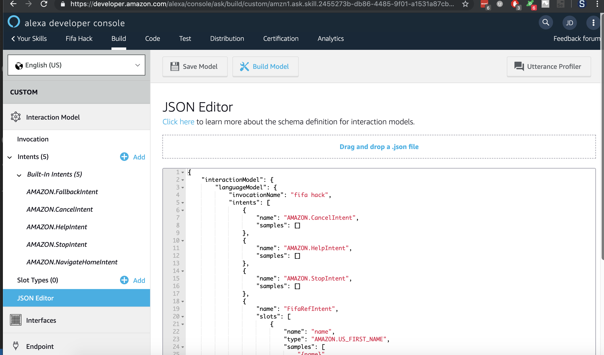

The skill menu on the left should now reflect the updated Intents.

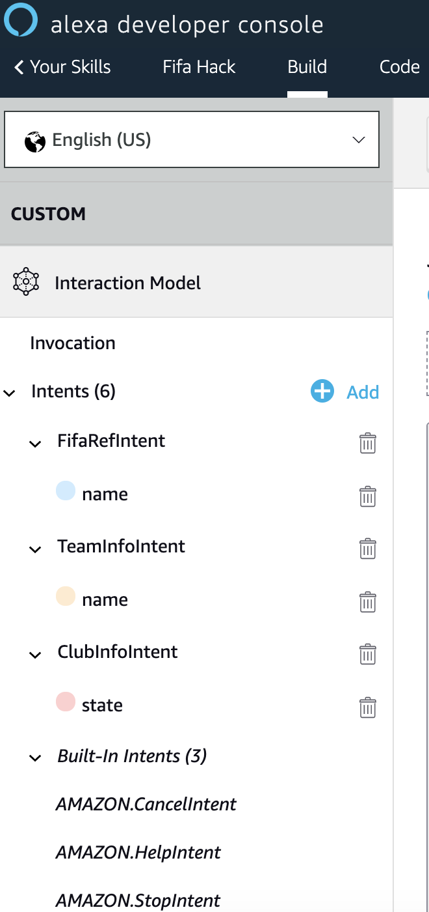

# Endpoints

Select the Endpoint in the bottom of the skill menu on the left.

Select AWS Lambda ARN
Configure Default Region to: `arn:aws:lambda:us-west-2:700164244043:function:fifa-ref-dev-alexa`

Click 'Save Endpoint'

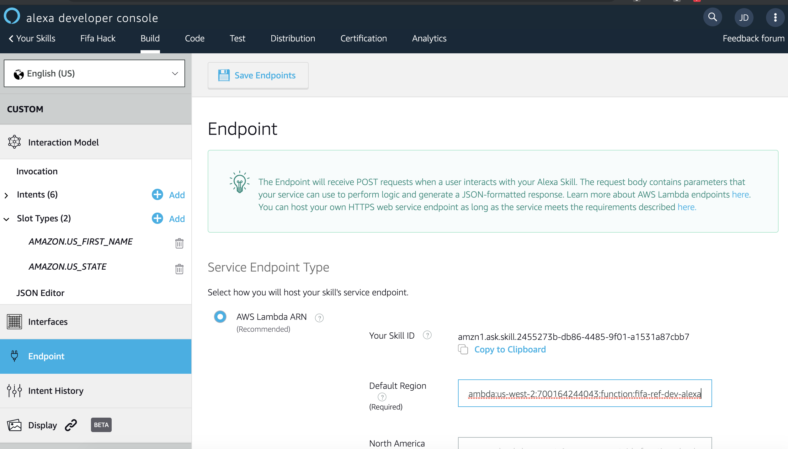

# Build the Model

Click Invocation at the top of the skill menu and click the 'Build Model' button.

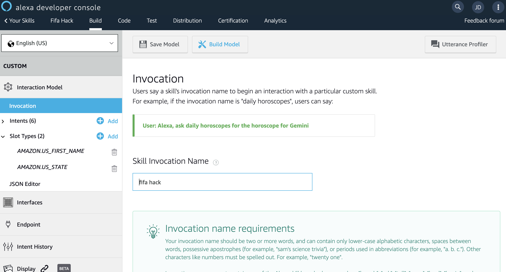

Wait for the success message to appear

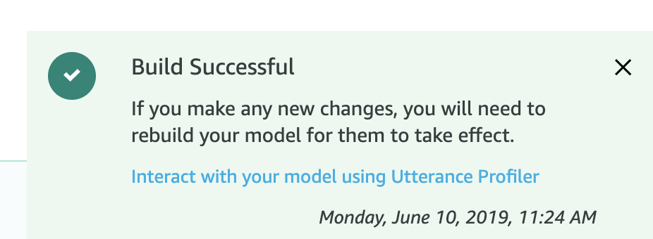

# Testing the Skill

Select the 'Test' item from the Menu up top.

Set the mode to Development.

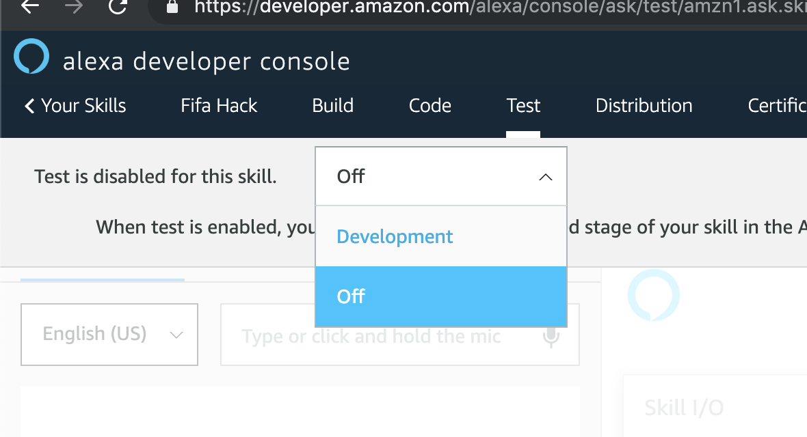

You can know initiate the skill and call the intents via the Alexa simulator:

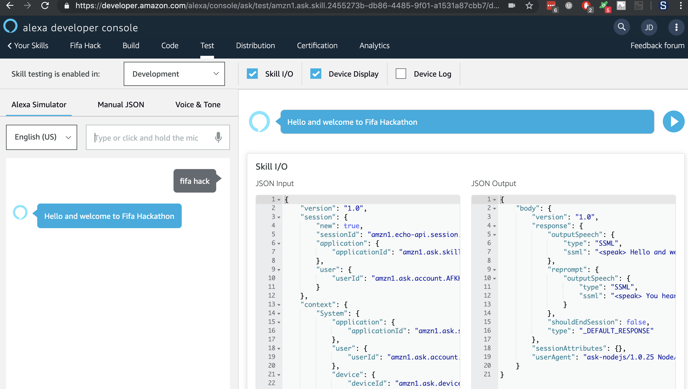
